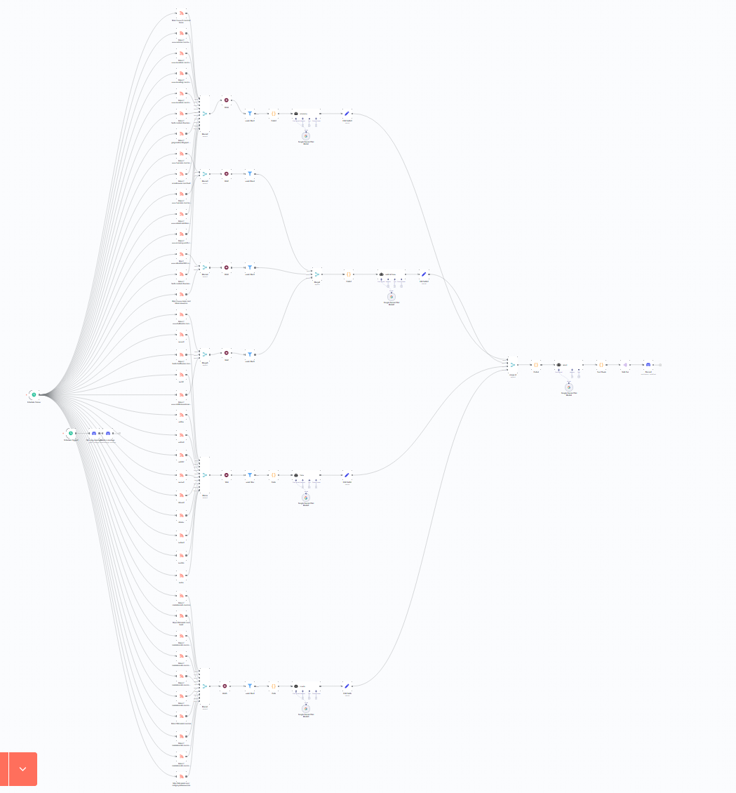
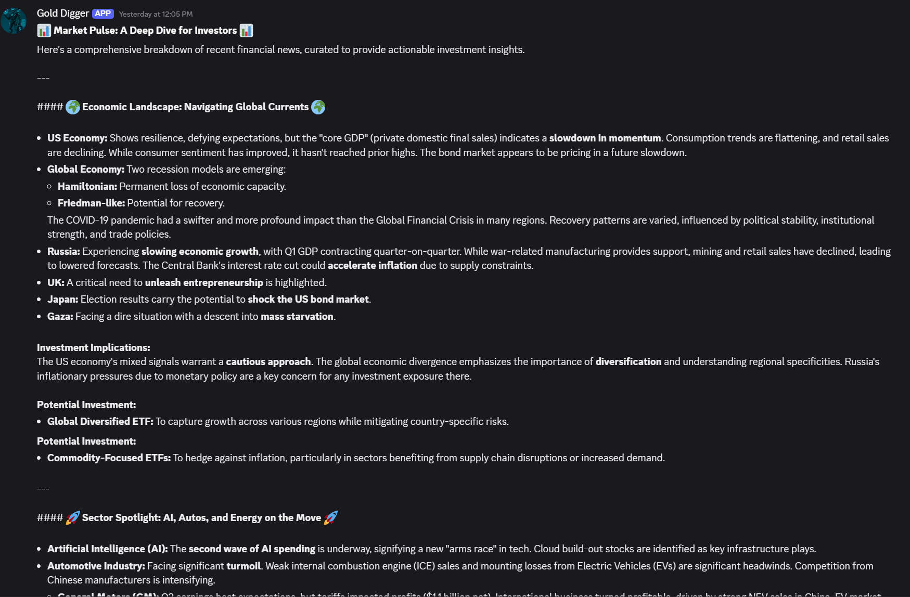

# n8n Finance Automation Workflow

This repository contains an n8n workflow designed to automate the collection, analysis, and reporting of financial news and data from various sources. The workflow gathers information on Forex, cryptocurrency, and general economic news, processes it, generates insights using AI, and sends a comprehensive report to a Discord channel.

## Workflow Preview

## 🚀 Features

- **Multi-Source Data Aggregation**: Fetches news and data from dozens of RSS feeds covering different financial sectors.
- **Categorized Analysis**: Separates data into distinct categories for focused analysis:
    - **Forex**: Tracks major currency pairs.
    - **Cryptocurrency**: Monitors news about Bitcoin, Ethereum, Monero, and market regulations.
    - **Economy**: Gathers general economic news from reputable sources.
    - **Commodities**: Collects information on gold and oil.
- **AI-Powered Insights**: Utilizes Language Models via LangChain and Google Gemini to summarize the collected articles and provide investment advice.
- **Automated Reporting**: Delivers a formatted report to a specified Discord channel.
- **Scheduled Execution**: Runs automatically at a predefined time to provide daily updates.
- **Data Filtering**: Processes only recent news (from the last 8 days) to keep the information relevant.

## ⚙️ Workflow Explained

The workflow is triggered by a schedule and performs the following steps:

1.  **Fetch RSS Feeds**: It starts by pulling data from a wide range of financial RSS feeds. These are grouped into the following categories:
    * Forex (e.g., Action Forex)
    * Cryptocurrency (e.g., Cointelegraph, Bitcoinist)
    * General Economy (e.g., NY Times, FT, Dow Jones)
    * Commodities (e.g., Oil & Gas 360, BullionStar)

2.  **Filter Recent News**: For each category, a **Filter** node sifts through the articles to only include those published within the last week.

3.  **Process and Summarize**:
    * A **Code** node extracts the title and content from each article.
    * A **LangChain Agent** powered by **Google Gemini** receives the processed text. Each agent has a specific personality (e.g., "forex finance analyst," "crypto finance analyst") and generates a summary and investment advice based on its category.

4.  **Merge and Final Report**:
    * The summaries from all categories are merged.
    * A final **LangChain Agent** creates a comprehensive, well-structured report from all the individual summaries.

5.  **Deliver to Discord**:
    * The final report is split into chunks to adhere to Discord's message length limits.
    * The workflow posts the report to a designated Discord channel.
    * Before sending the new report, it clears the previous messages in the channel to keep it clean.

## Example Output

## 🛠️ Setup and Installation

To use this workflow, you'll need:

1.  **An n8n instance**: You can run n8n on your own server or use n8n Cloud.
2.  **Import the workflow**: Download the `Finance.json` file from this repository and import it into your n8n instance.
3.  **Credentials**: You will need to set up the following credentials in n8n:
    * **Google Gemini API Key**: For the AI-powered analysis.
    * **Discord Bot Token and Webhook URL**: To allow n8n to post messages to your Discord server.
    * **(Optional) OpenRouter API Key**: If you choose to use models from OpenRouter.

Once the workflow is imported and the credentials are set, you can activate it.

## 🤝 Contributing

Contributions are welcome! If you have suggestions for new data sources, improvements to the AI prompts, or any other enhancements, feel free to open an issue or submit a pull request.

**And obviously this is not financial advice!**

